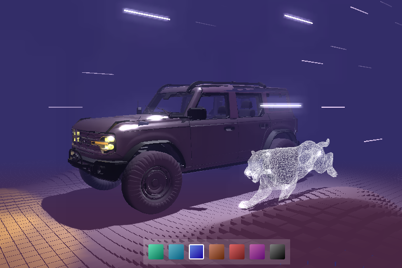

<h1 align="center">TroisJS</h1>
<div align="center" id="top">

</div>
&#xa0;


<p align="center">
  

  

  

  

  
</p>


<p align="center">
  <a href="#dart-about">About</a> &#xa0; | &#xa0; 
  <a href="#sparkles-features">Features</a> &#xa0; | &#xa0;
  <a href="#rocket-technologies">Technologies</a> &#xa0; | &#xa0;
  <a href="#white_check_mark-requirements">Requirements</a> &#xa0; | &#xa0;
  <a href="#checkered_flag-starting">Starting</a> &#xa0; | &#xa0;
  <a href="#memo-license">License</a> &#xa0; | &#xa0;
  <a href="https://github.com/matmon12" target="_blank">Author</a>
</p>

<br>

## :dart: About

Website made using 3D graphics. The project is written in Three.js and Vue. Has two scenes, musical accompaniment, film effect. The project is educational and is a replica of the Lusion Labs website https://exp-gemini.lusion.co/motion.

## :sparkles: Features

:heavy_check_mark: Adding music, music effect when you hold down the mouse button for a long time;\
:heavy_check_mark: Cinema effect when pressed for a long time;\
:heavy_check_mark: Interaction with a 3D scene, rotation;\
:heavy_check_mark: Ability to change the color of the car and scene;\
:heavy_check_mark: Loading window when loading the site for the first time;\
:heavy_check_mark: Using Animation;\
:heavy_check_mark: Animation when moving the cursor;\
:heavy_check_mark: Generating an infinite floor and using simplex noise;

## :rocket: Technologies

The following tools were used in this project:

- [Vue](https://vuejs.org/)
- [Three.js](https://threejs.org/)
- [TroisJS](https://troisjs.github.io/)
- [Anime.js](https://github.com/juliangarnier/anime/)
- [Pinia](https://pinia.vuejs.org/)
- [Tween.js](https://github.com/tweenjs/tween.js)
- [Simplex-noise](https://github.com/jwagner/simplex-noise.js)
- [Vite](https://vitejs.dev/)

## :white_check_mark: Requirements

Before starting :checkered_flag:, you need to have [Git](https://git-scm.com) and [Node](https://nodejs.org/en/) installed.

## :checkered_flag: Starting

```bash
# Clone this project
$ git clone https://github.com/matmon12/troisjs

# Access
$ cd troisjs

# Install dependencies
$ npm install

# Run the project
$ npm run dev

# Compiles and minifies for production
$ npm run build
```

## :memo: License

This project is under license from MIT. For more details, see the [LICENSE](LICENSE) file.

Made with :heart: by <a href="https://github.com/matmon12" target="_blank">Matmon</a>

&#xa0;

<a href="#top">Back to top</a>
